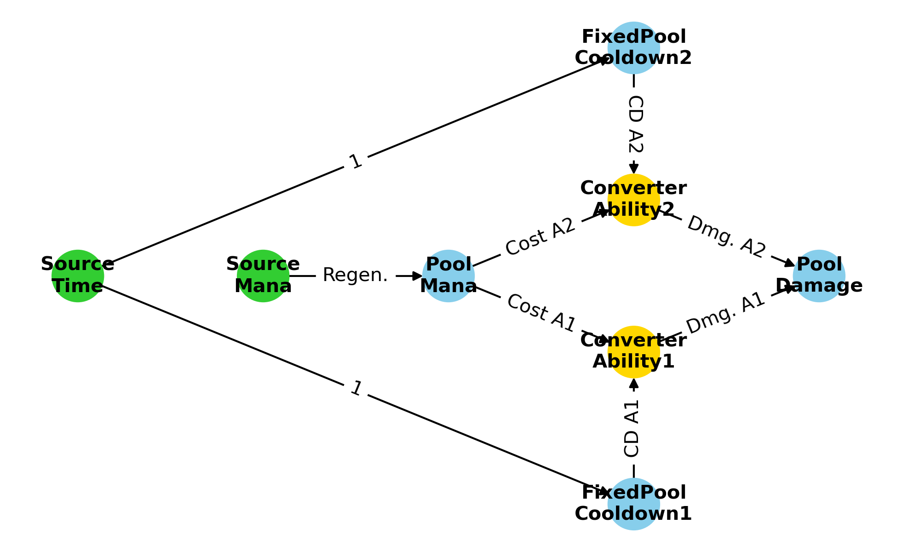
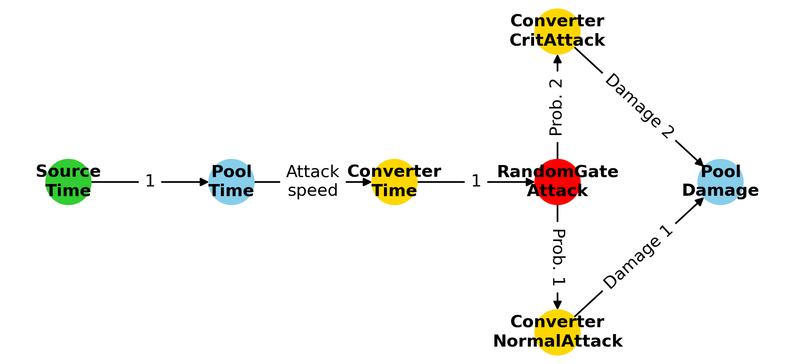

# GEEvo: Game Economy Evolution

This is the code repository for the GEEvo Framework (Game Economy Evolution) introduced in **Florian Rupp et al.**: _GEEvo: Game Economy Generation and Balancing using Evolutionary Algorithms_, IEEE Congress on Evolutionary Computation, 2024.
If you use this code in your work please cite:
```
@inproceedings{rupp_geevo_2024,
	title = {{GEEvo}: {Game} {Economy} {Generation} and {Balancing} with {Evolutionary} {Algorithms}},
	shorttitle = {{GEEvo}},
	url = {http://arxiv.org/abs/2404.18574},
	author = {Rupp, Florian and Eckert, Kai},
        booktitle = {{IEEE} {Congress} on {Evolutionary Computation} ({CEC})},
	year = {2024},
	note = {arXiv:2404.18574} ,
        pages = {to appear}
}
```

<div style="display: flex; flex-direction: row;">
<p align="center">
    
    
</p>
</div>


## Overview
With GEEvo you can
* generate graph-based game economies
* balance graph-based game economies simulation-driven

by applying the implemented evolutionary algorithms.

Each game economy consists of multiple node, where each node must be of a specific type.
Node types define how the resources are propagated through the graph and how they are e.g., transitioned
to other resources. The validity when generating new economies is defined with constraints 
(see paper or ``nodes.py``).

Economy graphs can be generated by selecting a specific pool node in the graph and
defining how many resources should be generated in that node after how many simulation steps.
Since the graphs may contain probabilistic elements, a graph's fitness is evaluated
simulation-driven. This can be understood as sampling from the distribution of resources
possible values of a specific node's resources at a specific time step.


## Examples

Examples on how to generate, simulate, plot, and balance graphs can be found in the demo Jupyter notebook (``demo.ipynb``).


## Limitations
* Loops within graphs are supported, however, positive feedback loops of game economies are not supported yet (see future work).
* Nodes trigger always recursively when enough resources are available. This implements play styles of spammers for instance. An interesting approach might be to implement an interface to control this trigger via scripts 
to enable a more intelligent behavior, dependent on the use case.


## Future Work
* Extend framework to support the dynamic change of weights on edges based on the current value of a pool (e.g., for positive feedback loops).
* Research on how to generate economies to be e.g., challenging fun etc.
